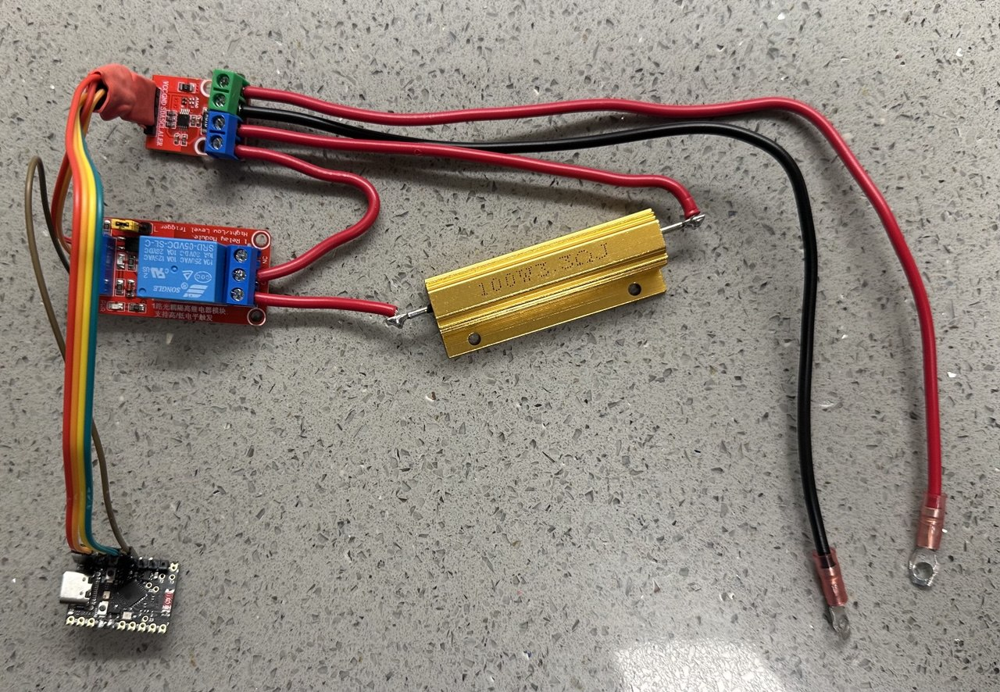
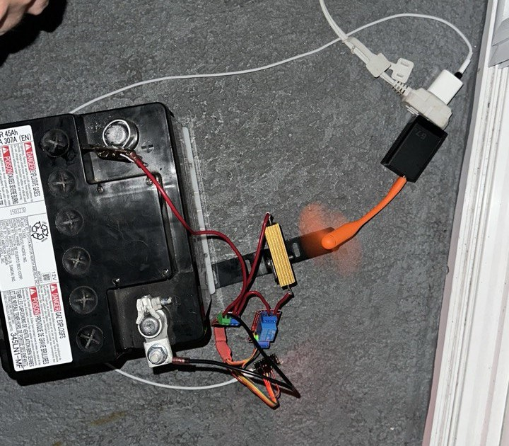

# ESP32 Capacity Battery Tester 🔋  

🚀 **Battery testing system using ESP32, INA226, and Web Server.**  

## 📌 Features  
✅ Measures **battery voltage** using INA226 </br>
✅ Battery capacity calculation </br>
✅ Automatic discharge stop at set voltage </br>
✅ Sound notification upon completion of the test</br>
✅ Logs test results to SPIFFS </br>
✅ **Web interface** to start/stop tests and configure parameters  

I don't use the current obtained from INA226. 
The calculation is made based on the voltage taken from INA226 and Load Resistance (default 3.3 Ohms, it is possible to change it via the web interface)
### ⚡ **Theoretical Current Calculation (Ohm’s Law)**  
The discharge current is calculated using **Ohm’s Law**:  
<p>I = V / R</p>

Where:  
- `I` = Current (A)  
- `V` = Voltage (V)  
- `R` = Resistance (Ω)  

## 🛠️ Hardware  
- **ESP32**  
- **INA226 Voltage & Current Sensor**  
- **Relay module**  
- **Resistor (Load)**  
- **Buzzer**  

## 📷 Screenshot  

## 📷  ESP32 Capacity Battery Tester  



## 🚀 Installation  
1. Clone repo:  
   ```bash
   git clone https://github.com/fobaty/ESP32-Battery-Capacity-Tester.git
2. Install Arduino IDE & ESP32 board
3. Install INA226 library:
  - Open Library Manager in Arduino IDE
  - Search INA226 by Rob Tillaart and install (https://github.com/RobTillaart/INA226)
4. Upload code to ESP32

🖥️ Web Interface
- Main page: http://192.168.4.1
- Start test: http://192.168.4.1/start
- Stop test: http://192.168.4.1/stop
- Set Voltage Threshold: http://192.168.4.1/set_threshold
- Set Load Resistance: http://192.168.4.1/set_resistance

  ## 📷  Testing
 - Fully charged the battery (without load I had 12.8 volts).
 - Make a short pause (30 minutes or 1 hour) after charging to let the battery cool down.
 - Discharged it to 10.5V using a 3.3Ω load resistor.
 - I also used a small fan to cool the resistor (what I found at home).
 - The measured capacity was only 12Ah, while the battery is rated at 45Ah.
 - On the web page in the test results it displays the Final voltage as 12.08 volts this voltage is measured after stopping the test and without load. If you measure with load it will be 10.5 volts, since the test automatically stops at 10.5 volts and disconnects the load

