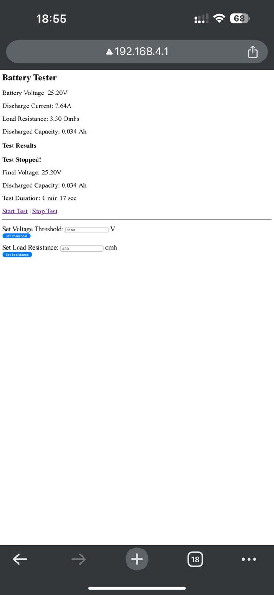

# ESP32 Capacity Battery Tester 🔋  

🚀 **Battery testing system using ESP32, INA226, and Web Server.**  

## 📌 Features  
✅ Measures **battery voltage** and **discharge current** using INA226
✅ Battery capacity calculation
✅ Automatic discharge stop at set voltage
✅ Sound notification upon completion of the test
✅ Logs test results to SPIFFS  
✅ **Web interface** to start/stop tests and configure parameters  

I do not use the current obtained from INA226. 
The calculation is made based on the voltage taken from INA226 and Load Resistance (default 3.3 Ohms, it is possible to change it via the web interface)
### ⚡ **Theoretical Current Calculation (Ohm’s Law)**  
The discharge current is calculated using **Ohm’s Law**:  
<p>I = V / R</p>

Where:  
- `I` = Current (A)  
- `V` = Voltage (V)  
- `R` = Resistance (Ω)  

## 🛠️ Hardware  
- **ESP32**  
- **INA226 Voltage & Current Sensor**  
- **Relay module**  
- **Resistor (Load)**  
- **Buzzer**  

## 📷 Screenshot  


## 🚀 Installation  
1. Clone repo:  
   ```bash
   git clone https://github.com/fobaty/ESP32-Battery-Capacity-Tester.git
2. Install Arduino IDE & ESP32 board
3. Install INA226 library:
  - Open Library Manager in Arduino IDE
  - Search INA226 by Rob Tillaart and install (https://github.com/RobTillaart/INA226)
4. Upload code to ESP32

🖥️ Web Interface
- Main page: http://192.168.4.1
- Start test: http://192.168.4.1/start
- Stop test: http://192.168.4.1/stop
- Set Voltage Threshold: http://192.168.4.1/set_threshold
- Set Load Resistance: http://192.168.4.1/set_resistance
